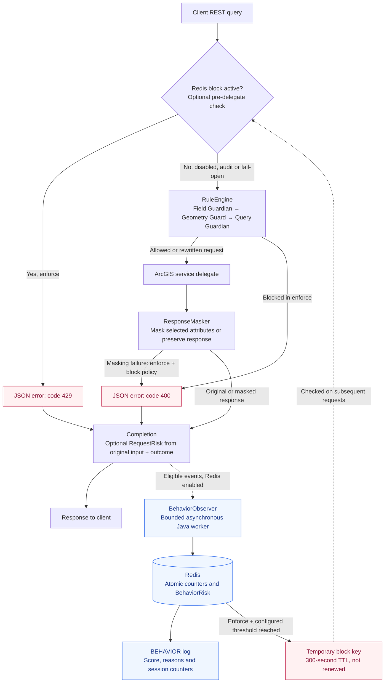

<p align="center">
  
</p>

# GeoVelis SOI — Extra Data protection for ArcGIS Server Map Services

GeoVelis SOI protects ArcGIS Server >= 12.1 map services by inspecting REST query requests before they reach the service and, when configured, post-processing JSON responses before they are returned to clients. It can score suspicious access patterns per request, user and inferred session, clamp expensive requests, restrict requested fields and envelope areas, mask sensitive attributes, and write security-relevant events to ArcGIS Server logs or an optional audit file.

**GeoVelis SOI** is a Java Server Object Interceptor for ArcGIS Server/ArcGIS Enterprise.

Features:

- REST audit logging through ArcGIS Server logs;
- **Query Guardian** rule;
- `audit` and `enforce` modes;
- automatic `resultRecordCount` clamping;
- observational risk scores for requests, users and inferred sessions;
- optional distributed BehaviorRisk through Redis, entirely in Java (for a Map Service with multiple ArcSOC.exe processes);
- **Geometry Guard** to block oversized envelopes;
- compact layer-specific policy overrides;
- **Field Guardian** for allowlist/denylist control on `outFields`;
- **response masking** for sensitive fields in Esri JSON and GeoJSON `query` responses;
- SOAP/OGC pass-through, with no active security logic on those channels.

> Note: this version is intentionally conservative. By default it runs with `mode=audit` and `responseMaskingEnabled=false`, so it does not block or modify anything until you explicitly enable the relevant properties.

---

## Request and Behavior Flow

This diagram follows an enabled SOI handling a REST `query`. Solid arrows show the
request/response path; dotted arrows show asynchronous observation and decisions that
affect subsequent requests.



In `audit`, rules and masking preserve the request/response; an existing Redis block is
reported without rejecting the request. In `enforce`, rules and masking apply their
configured protections. Redis enforcement additionally requires `riskEnabled=true`, a
configured endpoint and `riskBlockThreshold>0`. An unavailable block check fails open;
the remaining rules still run.

`ResponseMasker` runs **after ArcGIS returns**: it changes selected Esri JSON/GeoJSON
attributes, or replaces an unmaskable response with an error when strict masking is
enabled. A rule or Redis block happens **before ArcGIS is called**.

`RequestRisk` is computed at completion, including blocked requests. Redis observation
does not delay the response and can finish before or after it reaches the client. It
correlates authenticated users with a known layer; requests already rejected by the
Redis gate are excluded to avoid feeding the block back into the counters. The request
that triggers an automatic block has already executed; the decision affects later
requests. Without Redis, the optional user/session scores remain local to the SOI.

Relevant code: [REST pipeline](src/main/java/it/giancagis/arcgis/geovelis/GeoVelisSOI.java),
[response masking](src/main/java/it/giancagis/arcgis/geovelis/masking/ResponseMasker.java),
[block check](src/main/java/it/giancagis/arcgis/geovelis/behavior/BehaviorBlockGate.java),
and [Redis behavior script](src/main/resources/it/giancagis/arcgis/geovelis/behavior/observe.lua).

---

## SOI Properties

These properties appear in ArcGIS Server Manager when you enable the interceptor on a service.

For an initial telemetry deployment, set only `riskEnabled=true` and keep
`riskProfile=balanced`, `riskBlockThreshold=0` and `mode=audit`. Risk scoring observes
unless Redis behavior blocking is explicitly enabled in `enforce`. Adjust the optional envelope threshold only after
calibrating it against the service's coordinate units.

| Property | Default | Description |
|---|---:|---|
| `enabled` | `true` | Enables/disables GeoVelis. |
| `mode` | `audit` | `audit` logs only; `enforce` blocks/modifies. |
| `logOperationInput` | `true` | Logs a redacted summary of `operationInput`, retaining selected operational flags and numeric controls. |
| `maxLoggedInputLength` | `2000` | Maximum input length written to logs. |
| `fileAuditEnabled` | `false` | Duplicates GeoVelis events to file in addition to ArcGIS Server logs. |
| `fileAuditDirectory` |  | Directory where audit files are written. It must be writable by the ArcGIS Server service account. |
| `fileAuditPrefix` | `geovelis-audit` | Prefix for daily audit files. |
| `fileAuditRetentionDays` | `30` | Number of days to retain audit files before automatic cleanup. |
| `maxRecordCount` | `5000` | Explicit `resultRecordCount` values above this limit are automatically reduced in `enforce`; `audit` logs only. |
| `riskEnabled` | `false` | Enables observational risk telemetry for REST queries. |
| `riskProfile` | `balanced` | Threshold preset: `conservative`, `balanced`, or `sensitive`. |
| `riskLargeEnvelopeArea` | `0` | Optional envelope area threshold for scoring only, in input coordinate units squared; `0` disables this signal. |
| `riskRedisEndpoint` |  | Enables distributed behavior observation when set to `redis://host:6379` or `rediss://host:6379`; requires `riskEnabled=true`. Empty keeps local scoring. |
| `riskServiceKey` |  | Required with Redis: stable site/service identifier, identical on all instances of that service and distinct for unrelated services. |
| `riskBlockThreshold` | `0` | `0` disables Redis block creation/checking. `1`–`100` enables a 300-second block when current BehaviorRisk reaches the threshold in `enforce`; requires Redis and `riskEnabled=true`. `audit` reports only. |
| `geometryGuardMaxEnvelopeArea` | `0` | A positive value enables the envelope guard; `enforce` blocks areas above it. `0` disables the guard. |
| `layerPolicyOverrides` |  | Layer-specific overrides in `layerId.property=value;...` format. |
| `fieldGuardianEnabled` | `false` | Enables `outFields` checks for REST queries. |
| `fieldGuardianAllowedOutFields` |  | Allowed `outFields`, comma-separated. If set, every other field is considered disallowed. |
| `fieldGuardianDeniedOutFields` |  | Denied `outFields`, comma-separated. |
| `fieldGuardianBlockOnDeniedFields` | `false` | In `enforce`, blocks the request instead of removing disallowed fields when removal is possible. |
| `responseMaskingEnabled` | `false` | Enables Esri JSON and GeoJSON response post-processing. |
| `responseMaskingFields` | `CODICE_FISCALE,EMAIL,TELEFONO` | Selects the fields to mask, comma-separated. A field-specific strategy alone does not select a field. |
| `responseMaskingReplacement` | `****` | Replacement value used in the JSON response. |
| `responseMaskingStrategy` | `full` | Global masking strategy: `full`, `partialEmail`, `partialPhone`, `partialFiscalCode`, `hash`, `nullify`. |
| `responseMaskingFieldStrategies` |  | Overrides the strategy for selected fields, for example `EMAIL:partialEmail,TELEFONO:partialPhone`. |
| `responseMaskingFailPolicy` | `keepOriginal` | Behavior on masking errors or unsupported query responses: `keepOriginal` or `block`. Blocking applies only in `enforce`. |
| `responseMaskingApplyToQueryOnly` | `true` | Applies masking only to REST `query` operations. |

---

## Where Logs Are Written

GeoVelis-generated diagnostic messages and error response text are in English.
For example: `Potentially broad query detected: generic condition or outFields wildcard.`

Request logging hides SQL expressions, field expressions, geometry, object IDs, tokens,
and other arbitrary input values. Unknown parameter names and values are omitted; only
their count is recorded. Rule messages do not repeat query values, and GeoVelis error
logs record the exception type rather than its potentially sensitive message.
`maxLoggedInputLength` is applied after redaction; `logOperationInput=false` still disables
the input summary entirely.

GeoVelis always writes to native ArcGIS Server logs through `ServerUtilities.getServerLogger()`.

In ArcGIS Server Manager, open:

```text
ArcGIS Server Manager -> Logs -> View Logs
```

Search for messages with these prefixes:

```text
[GeoVelis]
[GeoVelis][IN]
[GeoVelis][RULE]
[GeoVelis][MASKING]
[GeoVelis][RISK]
[GeoVelis][BEHAVIOR]
[GeoVelis][BEHAVIOR_BLOCK]
[GeoVelis][OUT]
[GeoVelis][ERROR]
```

To also write a file copy, enable:

```text
fileAuditEnabled=true
fileAuditDirectory=C:\ArcGISServer\geovelis-logs
fileAuditPrefix=geovelis-audit
fileAuditRetentionDays=30
```

The SOI creates one file per day:

```text
geovelis-audit-2026-07-04.log
```

Cleanup is best-effort: about once per hour, GeoVelis deletes `geovelis-audit-*.log` files older than `fileAuditRetentionDays`. Write or cleanup errors never interrupt service requests.

> Note: the directory must exist or be creatable by the Windows/Linux account running ArcGIS Server. Otherwise GeoVelis continues logging only to ArcGIS Server logs.

---

## Configuration Validation

Configuration values are validated when the SOI is constructed. Invalid modes, fail
policies, booleans, numeric limits, masking strategies, and malformed or unsupported
layer overrides cause an explicit configuration error instead of silently falling back
to a less restrictive setting. Missing or blank scalar properties retain their defaults.

- `mode` accepts `audit` or `enforce`.
- `responseMaskingFailPolicy` accepts `keepOriginal` or `block`.
- Booleans accept `true`/`false`, `yes`/`no`, or `1`/`0`, ignoring case.
- `maxRecordCount` and `fileAuditRetentionDays` must be positive integers.
- `maxLoggedInputLength` must be a non-negative integer.
- Envelope area thresholds must be finite, non-negative numbers.
- `riskProfile` accepts `conservative`, `balanced`, or `sensitive`.

A rejected configuration does not replace the previous configuration in the same
instance. On service startup, a construction error can prevent the SOI from loading;
correct configuration errors before restarting the service.

---

## How Query Guardian Works

Query Guardian inspects REST `query` requests. `where=1=1`, other recognized generic
conditions and `outFields=*` produce audit warnings but never block on their own.
Risk scoring can combine these signals with other request and activity indicators.
Configured field restrictions and envelope limits still apply independently.

An explicit `resultRecordCount` above `maxRecordCount` is automatically reduced only
in `enforce`. In `audit`, the original input is
preserved. If the parameter is omitted, GeoVelis does not insert a limit: this is
not a cap on all records obtainable through pagination.

The broad-query checks recognize specific patterns; they are not a general SQL analyzer.
The preventive rules apply to `query`, not to all REST operations such as `identify`
or `find`. SOAP and OGC remain pass-through.

---

## Distributed BehaviorRisk with Java and Redis

The optional architecture is **Java SOI → Java background worker → Redis**. There is
no .NET service or separate application to install. The SOI computes `RequestRisk`;
the Java behavior module uses an atomic Redis script to correlate activity from all
instances connected to the same Redis endpoint. Redis contains temporary counters and
fingerprints, not complete requests. Scores are observational by default. Optional
BehaviorRisk enforcement creates temporary Redis decisions and checks them before the
ArcGIS delegate is called. RequestRisk alone never causes a block.

### Enable the Redis Backend

Configure the SOI properties, for example:

```properties
enabled=true
riskEnabled=true
riskProfile=balanced
riskRedisEndpoint=redis://127.0.0.1:6379
riskServiceKey=production/Catasto
```

`riskServiceKey` identifies the service scope; use the same value on every replica and
include the site/folder where needed to distinguish unrelated services. Valid characters
are letters, digits, `_`, `.`, `/`, and `-` (maximum 160 characters). It is explicit because
the request resource alone does not reliably identify the service across instances.

Before enabling the backend, configure these environment variables for the **ArcGIS
Server process**, not just your interactive terminal:

| Environment variable | Purpose |
|---|---|
| `GEOVELIS_RISK_HMAC_KEY` | Required: a randomly generated secret of at least 32 characters, identical across participating ArcSOC instances/machines. Used for stable pseudonymous identities and fingerprints. |
| `GEOVELIS_REDIS_USERNAME` | Optional Redis ACL username. |
| `GEOVELIS_REDIS_PASSWORD` | Optional Redis password; required when a username is set. |

For Windows, make the environment available to the ArcGIS Server service account and
restart the ArcGIS Server service so new ArcSOC processes inherit it. Restarting only
a map service may retain the parent process's previous environment. Keep the HMAC key
stable; changing it starts a separate correlation history. Use different secrets for
unrelated authentication realms whose usernames could otherwise collide. Never put
passwords in `riskRedisEndpoint`; credential-bearing URLs are rejected.

The local container verified during development is `geosentinel-redis` (its existing
Docker name is independent of the project name), Redis 8.2,
published on `127.0.0.1:6379`. This address works only when ArcGIS Server runs on the same
host. An ArcGIS Server on another machine needs a reachable Redis endpoint; this
container's current loopback binding does not expose it to other machines.

The transport supports a standalone Redis endpoint, database 0, optional AUTH and TLS
with `rediss://` using the JVM trust store and hostname verification. Redis Cluster and
Sentinel discovery are not implemented. Commands used are `SCRIPT LOAD`, `EVALSHA`, and
`EVAL` for block checks; scripts use `TIME`, `HGET`, `HSET`, `HDEL`, `HEXISTS`, `DEL`,
`EXPIRE`, `SET`, `GET`, and `PTTL`. Grant the configured Redis account access to both
`geovelis:behavior:v1:*` and `geovelis:blocked:v1:*` namespaces and these
operations. No additional runtime JAR is required; the client implements the small
[RESP2](https://redis.io/docs/latest/develop/reference/protocol-spec/) subset used here.

### What Is Correlated

The distributed scope is **authenticated identity + configured service + layer**.
Two ArcSOC processes handling the same identity/service/layer update the same Redis hash.
Different users, services, layers and risk profiles have separate histories. This first
backend does not also calculate a global score across every service/layer for a user.

Each queued event contains a unique event ID, pseudonymous scope, query/batch fingerprints,
offset, original requested page size, effective page size after clamping, ObjectID count,
request score/signals, response bytes and outcome. Raw usernames, SQL, tokens, ObjectID
lists, coordinates and response bodies are not queued or stored in Redis.

Anonymous identities still receive `RequestRisk` but do not get distributed behavior
state; they are not merged into one shared anonymous user. Requests without a resolvable
layer ID are also excluded from this layer-scoped backend. Large envelopes are a request
signal; they are not proof that the layer's full extent was requested.

Redis holds sixty one-second buckets for the recent activity window. Its server clock
provides a common time base; counting uses event **ingestion time**, with up to one second
of window-boundary precision. A separate 300-second idle TTL is refreshed on observation.
An active session rotates after eight hours. The TTL removes inactive state; it does
not define the recent activity window. Updates are atomic through
[Redis scripting](https://redis.io/docs/latest/develop/programmability/eval-intro/).

`BehaviorRisk` is independent of `RequestRisk` and capped at 100:

| Reason | Points | Trigger |
|---|---:|---|
| `HighQueryFrequency` | 25 | Recent request count reaches the profile threshold. |
| `HighVolume` | 25 | Recent requested record count OR returned response bytes reaches its threshold; contributes once. |
| `SequentialPaging` | 35 | A sequence of contiguous offsets reaches the profile threshold. |
| `IdsThenObjectIdBatches` | 40 | Broad `returnIdsOnly` response followed within five minutes by at least three distinct ObjectID batch fingerprints in the recent window. |

| Threshold | Conservative | Balanced | Sensitive |
|---|---:|---:|---:|
| Requests in recent window | 60 | 30 | 15 |
| Requested records in recent window | 100000 | 50000 | 10000 |
| Returned bytes in recent window | 25 MiB | 10 MiB | 5 MiB |
| Contiguous paging transitions | 8 | 5 | 3 |

Paging is tracked separately for each query fingerprint. A transition requires
`nextOffset = previousOffset + previousEffectivePageSize` and less than 60 seconds between
observations. Missing explicit page sizes cannot establish that transition. Offset zero
starts a new sequence. Non-increasing offsets do not advance it and are reported; events
arriving out of order can reduce detection. Fingerprints ignore page offset, page size,
token and `f`, and sort top-level JSON keys; they do not normalize SQL or nested JSON.

With `balanced`, 40 contiguous pages requesting 2000 records each produce 40 requests,
80000 requested records and 39 transitions: **BehaviorRisk = 25 + 25 + 35 = 85**.
Requested records measure intent, not the number of features actually returned. The
effective page size and returned bytes are logged separately. Counts include failed
attempts, except requests rejected by the Redis behavior gate. Failed/blocked requests
do not advance paging, returned-byte volume or ID-batch
correlation. Ordinary delegate responses, including JSON error bodies, retain the
`RETURNED` classification; it is not a guarantee of a successful feature query.

The ObjectID pattern is a possible bulk extraction signal. Batch fingerprints distinguish
identical strings, not semantic ID sets: reordered or overlapping batches can look
different. The module does not retain all enumerated IDs or prove complete layer coverage.

### Bounds, Failures and Logs

Each SOI uses one lazily started daemon worker and a queue of at most 256 compact events.
Redis connection/read timeouts are one second each. On failure, observation backs off for
10 seconds; events older than 30 seconds in the queue are discarded. Queue overflow and
failures produce throttled `status=UNAVAILABLE`, `behaviorRiskScore=NA` warnings with
`droppedEvents`. Event delivery is best effort, not durable: stopping/reconfiguring an
instance can discard pending events. Observation does not wait for Redis on the request
thread; enabling block checks adds the bounded pre-delegate lookup described below.

Each Redis hash retains at most 32 paging fingerprints, 64 ObjectID batch fingerprints,
256 deduplication IDs and 60 time buckets, using bounded rings. Deduplication covers the
last 256 events for that scope. Network failures are not automatically retried because
the update may already have completed; only a `NOSCRIPT` cache miss is safely reloaded
and retried. Capacity eviction or Redis restart/eviction can lose evidence. Total Redis
memory still depends on the number of active identities/service/layer combinations.

With Redis enabled, `[RISK]` contains the local request assessment with
`correlation=REDIS_ASYNC` and local user/session scores `NA`. Successful asynchronous
updates produce `[BEHAVIOR]` events with `scope=REDIS_SERVICE_LAYER`, `behaviorRiskScore`,
reasons, shared session ID, `sessionPeakBehaviorRisk`, counters and `eventId`. These
events are INFO-level messages in the existing ArcGIS/file audit sinks; unavailable
backend messages are WARNING. Redis centralizes the state, while event logs remain in
the existing sinks on the originating server. Removing the endpoint returns to local
scoring; Redis failures never silently fall back to a misleading local BehaviorRisk.

To obtain file logs as well, set `fileAuditEnabled=true` and an absolute
`fileAuditDirectory`. The folder is created on first write if the ArcGIS service account
has permission; file-write failures are currently ignored. Enable INFO capture in
ArcGIS Server to see successful `[BEHAVIOR]` messages, then issue new queries.

### Temporary Redis Blocks and Simulation

Enable enforcement on a test service after configuring the Redis endpoint, service key
and HMAC secret:

```properties
enabled=true
mode=enforce
riskEnabled=true
riskBlockThreshold=80
```

At **current BehaviorRisk >= 80**, the asynchronous observer creates a separate string
key with value `1` and a 300-second TTL. The key uses the same profile, pseudonymous
service, user and layer scope as the behavior hash, with prefix `geovelis:blocked:v1:`.
Creation uses [SET NX EX](https://redis.io/docs/latest/commands/set/), so later events
cannot renew an existing block. Only `RETURNED` observations can create automatic blocks;
session peak and RequestRisk are not compared with this threshold.

The triggering request has already run. Once the observer writes the decision, subsequent
authenticated `query` requests for that scope are rejected **before rules and the ArcGIS
delegate**. Requests already in flight can still finish. Anonymous users and requests
without a layer ID remain outside distributed behavior enforcement.

The response is an ArcGIS-style JSON error with `error.code=429` and a retry delay in its
details. This JSON code does not guarantee HTTP transport status 429. Response headers
are converted to JSON consistently with other SOI errors. Rejected requests emit
`[BEHAVIOR_BLOCK] decision=BLOCK` and `[RISK] outcome=BEHAVIOR_BLOCKED`; they are not fed
back into the Redis observation counters, so retries do not prolong the block.

In `mode=audit`, scores reaching the configured threshold log `decision=WOULD_BLOCK`
without creating a key. Existing keys log `[BEHAVIOR_BLOCK] decision=AUDIT_ONLY` and the
request passes. `riskBlockThreshold=0` disables both creation and lookup, even if a key
still exists. Keep mode, threshold, profile, service key and HMAC secret consistent across
all enforcing instances; changing profile or identity scope selects different keys.

For an immediate manual simulation:

1. Deploy the updated SOE, configure `mode=enforce` and `riskBlockThreshold=80`, then restart
   the service and make an authenticated query.
2. Copy the complete `blockKey=...` value from its `[BEHAVIOR]` log event.
3. On the Docker host, set that exact key (replace the placeholder):

   ```powershell
   $blockKey = 'COMPLETE_BLOCK_KEY_FROM_LOG'
   docker exec geosentinel-redis redis-cli SET "$blockKey" 1 EX 300 NX
   docker exec geosentinel-redis redis-cli PTTL "$blockKey"
   ```

4. Repeat a query with the same identity, service and layer. Expect JSON `error.code=429`
   and `[BEHAVIOR_BLOCK] decision=BLOCK`.
5. Wait for expiration, or remove only that decision to release it early:

   ```powershell
   docker exec geosentinel-redis redis-cli DEL "$blockKey"
   ```

The gate requires value `1` and a remaining TTL of at most 300 seconds. Keys without an
expiry, with a longer TTL or an invalid value are treated as invalid and reported, not
as permanent bans. A manual deletion may be followed by a new automatic block if resumed
activity still exceeds the threshold; set `riskBlockThreshold=0` to end the simulation.
No blocking keys are created on real users by the automated tests.

To test automatic creation with `balanced` and threshold 80, send 30 contiguous query
pages within 60 seconds, requesting 2000 records each with matching effective page size:
offsets `0, 2000, 4000, ...`. Frequency (25), volume (25) and sequential paging (35) reach
85. Use a test layer with pagination support and ensure the configured clamp does not
change the expected step. Wait for `[BEHAVIOR] decision=BLOCK_CREATED` and then issue
another request. `1=1` and `outFields=*` by themselves do not trigger this decision.

Block checks use a separate bounded pool (two workers, queue length 16), 150 ms socket
connect/read timeouts and a 250 ms wait budget for each submitted lookup. There is no
allow/block cache. If Redis is unavailable, a lookup times out, a key is invalid or the
pool is full, the SOI **allows the request** and emits `[BEHAVIOR_BLOCK] decision=FAIL_OPEN`.
Existing field, geometry and masking rules still apply. This choice preserves service
availability but means Redis failure or saturation can bypass behavior blocking.
The asynchronous observer retains its separate queue/backoff behavior.

`[BEHAVIOR]` records `OBSERVE`, `WOULD_BLOCK`, `BLOCK_CREATED`, or `BLOCK_EXISTS` at INFO
level. Pre-delegate `[BEHAVIOR_BLOCK]` events use WARNING and include the decision, reason
and remaining TTL. Block creation does not mean the triggering request was rejected.

The SOI still declares `supportsSharedInstances=false`. Redis solves correlation across
dedicated instances/processes/machines; it does not itself certify compatibility with
the ArcGIS shared instance pool or change which service operations reach the interceptor.

## Local Risk Scores: Request, User and Session

The local user/session behavior described below applies when `riskRedisEndpoint` is empty.
The static request signals also apply when Redis is enabled.

Enable telemetry with three properties:

```properties
riskEnabled=true
riskProfile=balanced
riskLargeEnvelopeArea=0
```

Each completed REST `query` produces one `[GeoVelis][RISK]` event, including queries
blocked by another rule or ending with an exception. Scoring uses the original request
before field rewriting and record clamping. It never changes the response or blocks a
request, in either `audit` or `enforce`; telemetry failures are isolated from the response.
`enabled=false` disables risk observation too.

All scores are capped at 100. Levels are `LOW` (0–39), `MEDIUM` (40–69), and `HIGH`
(70–100). These are initial heuristics for calibration, not probabilities of abuse.

| Score | Meaning |
|---|---|
| `requestRiskScore` | Sum of the current request's static signals below. |
| `userRiskScore` | Highest static request score in the user's current 60-second window, plus frequency, repeated paging and response volume signals in that window. |
| `sessionRiskScore` | Highest static request score during the inferred session, plus observed frequency/paging signals retained for that session and its cumulative response volume signal. |

Each temporal signal contributes once. Request scores are not repeatedly added together.
The user window is fixed, starts with the first observed request and resets on the first
request at or after 60 seconds. Session volume uses a higher threshold, so a session score
can be lower than a user score. Events include the individual contributions for all three
scores, request counts, byte totals, increasing page count, elapsed time and outcome.

| Signal | Points | Trigger |
|---|---:|---|
| `BROAD_QUERY` | 10 | Empty `where`, `1=1`, `OBJECTID=OBJECTID`, `OBJECTID>0`, or `FID=FID`, ignoring whitespace and parentheses. |
| `ALL_FIELDS` | 10 | `outFields=*`. |
| `GEOMETRY` | 5 | Geometry requested, including omitted `returnGeometry`; excludes counts, IDs, extents and non-empty statistics. |
| `LARGE_ENVELOPE` | 20 | Envelope area at least `riskLargeEnvelopeArea`, when positive. |
| `IDS_ONLY` | 15 | `returnIdsOnly=true`. |
| `LARGE_PAGE` | 10 | Explicit `resultRecordCount` reaches the profile threshold. |
| `PAGING` | 5 | Positive `resultOffset`. |
| `BROAD_GEOMETRY_EXPORT` | 15 | Broad query, all fields and geometries together. |
| `REPEATED_PAGING` | 20 | Increasing offsets for the same query and layer reach the profile threshold. |
| `HIGH_FREQUENCY` | 20 | Request count in a user window reaches the profile threshold. |
| `HIGH_RESPONSE_VOLUME` | 20 | Returned response bytes reach the window/session threshold. |

The last three signals apply to user/session scores. Profile thresholds are:

| Threshold | Conservative | Balanced | Sensitive |
|---|---:|---:|---:|
| Requests per 60-second user window | 60 | 30 | 15 |
| Pages in an increasing sequence | 8 | 5 | 3 |
| Response bytes per user window | 25 MiB | 10 MiB | 5 MiB |
| Response bytes per session | 250 MiB | 100 MiB | 50 MiB |
| Explicit page size | 5000 | 1000 | 500 |

For example, `where=1=1&outFields=*&returnGeometry=true` scores 40. Adding a sufficiently
large envelope scores 60; repeated paging can raise user/session scores above 70.
`where=1=1` alone contributes only 10 points and never causes a block.

### Identity, Sessions and Correlation Limits

Activity is grouped by the authenticated ArcGIS username across layers **within one
SOI instance**. A session is inferred from that activity: it expires after 15 minutes
without a query and rotates after 8 hours even when active. It is not a browser session
or token lifetime. Multiple clients sharing an account share this inferred session.
Anonymous or unavailable identities get a request score and `NA` user/session scores;
unrelated anonymous visitors are not combined into a fictitious user.

Paging correlation requires the same layer and query fingerprint, strictly increasing
offsets and less than 60 seconds between successive pages. Offset zero counts as the
first page. Duplicate or decreasing offsets restart the sequence. For the user score,
the threshold must be reached within the current window; a session sequence can cross
window boundaries. Fingerprinting ignores offsets, page sizes, tokens and output format,
and sorts top-level JSON keys. It does not normalize SQL or nested JSON semantically.
Interleaved queries are tracked separately; concurrent requests are observed in completion
order, which may differ from arrival order.

State is bounded to 1000 users and 32 query sequences per session, with least-recently-used
eviction. `capacityEvictions` reports capacity removals. Eviction, reconfiguration and
restart lose history. There is no shared state across SOI instances, SOC processes,
machines or services, so distributed activity can be underestimated.

`LARGE_ENVELOPE` supports JSON envelopes and comma-separated bounds, using input coordinate
units squared without reprojection. It does not compare with the layer's true full extent
or inspect polygon/polyline envelopes. Calibrate `riskLargeEnvelopeArea` for the service;
it is independent of the blocking `geometryGuardMaxEnvelopeArea` setting.

Byte totals measure bodies returned by the SOI after masking, before any later transport
compression. They exclude SOI-generated blocking errors and delegate exceptions; ordinary
responses returned by the delegate, including JSON error bodies, count toward the total.
This version does not count returned features. Request counts include failed attempts.
Malformed input is marked `inputStatus=INVALID_JSON`; input over 65,536 characters is marked
`TOO_LARGE`. Those requests still contribute activity counters but omit static input signals.
A low score is therefore not a guarantee of safe access.

### Reading the Telemetry

Risk events include `scoreVersion=1`, `profile`, `decision=OBSERVE`, `scope=SOI_INSTANCE`,
an instance ID, a pseudonymous subject, a session ID and a layer ID. Subject IDs are SHA-256
hashes salted per instance; they cannot be joined across restarts/instances. Risk events
contain no raw username, SQL, token, coordinates or response attributes. Other existing
audit event types retain their existing identity fields.

Outcomes are `RETURNED`, `RULE_BLOCKED`, `BEHAVIOR_BLOCKED`, `MASKING_BLOCKED`, `ERROR`, or `NO_DELEGATE`.
Native log severity is INFO, or WARNING when any score reaches 70; configure ArcGIS Server
log visibility accordingly. The optional audit file receives the same risk event.
Collect examples from ArcGIS Pro, Map Viewer and Experience Builder before interpreting
high scores as anomalous activity or designing future enforcement.

---

## How Geometry Guard Works

Geometry Guard checks REST queries with envelope geometry and computes the area:

```text
abs((xmax - xmin) * (ymax - ymin))
```

With:

```text
mode=enforce
geometryGuardMaxEnvelopeArea=1000000
```

a query with:

```json
{
  "geometry": {
    "xmin": 0,
    "ymin": 0,
    "xmax": 5000,
    "ymax": 5000
  }
}
```

is blocked because the area is `25000000`, which is greater than the threshold.

Both JSON envelopes and textual bounding boxes are supported:

```text
geometry=0,0,5000,5000
```

In `audit`, GeoVelis writes a warning but lets the request pass.

The area is computed in the input coordinate units squared, without reprojection.
The guard recognizes envelopes; it does not compute polygon or polyline envelopes.

---

## Layer Policies

`layerPolicyOverrides` customizes selected settings for individual layers within the
service where the SOI is enabled. Global settings remain the defaults. Leave this
property empty when every layer should use the same settings.

The layer ID is the numeric identifier from the REST resource, not the layer's display
name or its position in a client application. For example, this request uses layer `0`:

```text
/MapServer/0/query
```

An SDK resource such as `layers/0` also resolves to layer `0`. If the request has no
resolvable layer ID, GeoVelis uses the global settings.

### Syntax and Supported Properties

Enter all overrides as one property value in ArcGIS Server Manager:

```text
layerId.property=value;layerId.property=value
```

Separate entries with `;`. Use `|` between field names inside a layer-specific masking
list. Property names are case-insensitive; spaces around entries, keys and values are
ignored. Use the layer ID exactly as exposed by the service, without adding leading zeros.

Only these three properties support layer overrides:

| Property | Valid value | Effect on the selected layer |
|---|---|---|
| `maxRecordCount` | Positive integer | In `enforce`, clamps an explicit `resultRecordCount` above this limit. It does not add a missing limit or cap total records across pagination. |
| `geometryGuardMaxEnvelopeArea` | Finite number greater than or equal to zero | Sets the envelope-area threshold in input coordinate units squared. A positive value enables the check; `0` disables it for this layer. |
| `responseMaskingFields` | Non-empty field list, for example `EMAIL\|TELEFONO` | Replaces the global selection of attributes to mask on this layer. Field names are matched case-insensitively. |

### Complete Example

Suppose the service has layers `0`, `1` and `2`. Configure:

```properties
enabled=true
mode=enforce
maxRecordCount=5000
geometryGuardMaxEnvelopeArea=0
responseMaskingEnabled=true
responseMaskingFields=EMAIL,TELEFONO
responseMaskingStrategy=full
responseMaskingFieldStrategies=CITY_NAME:partialFiscalCode,POP_RANK:nullify
layerPolicyOverrides=0.maxRecordCount=1000;2.responseMaskingFields=CITY_NAME|POP_RANK;2.geometryGuardMaxEnvelopeArea=250000
```

The effective settings are:

| Layer | Explicit page-size limit | Envelope-area limit | Fields selected for masking |
|---|---:|---:|---|
| `0` | 1000 | Disabled (`0`) | `EMAIL`, `TELEFONO` |
| `1` | 5000 | Disabled (`0`) | `EMAIL`, `TELEFONO` |
| `2` | 5000 | 250000 | `CITY_NAME`, `POP_RANK` |

For layer `2`, `CITY_NAME` uses `partialFiscalCode` and `POP_RANK` uses `nullify`, as
specified by the global field-strategy map. Other selected fields use the global `full`
strategy unless they have their own field-specific strategy. Fields absent from a
response are simply not masked.

### Precedence and Global Switches

Overrides are resolved **per property**: changing layer `0`'s record limit does not
change its masking fields or geometry limit. An override replaces the global value;
it is not combined with it or automatically restricted to the stricter value.

**A layer-specific `responseMaskingFields` list replaces the entire global field list.**
In the example, layer `2` does not mask `EMAIL` or `TELEFONO`. To retain those fields as
well, replace that entry with:

```text
2.responseMaskingFields=CITY_NAME|POP_RANK|EMAIL|TELEFONO
```

The global switches still apply:

- `enabled=false` disables the SOI protections.
- `mode=audit` logs what would happen and preserves requests and responses; `enforce`
  applies clamping, blocking and masking.
- `responseMaskingEnabled=true` is required for any layer's masking list to take effect.
  Masking strategies, failure policy and operation scope remain global.
- A positive layer envelope limit enables Geometry Guard on that layer even when the
  global limit is `0`. A layer override of `0` disables the check on that layer even when
  the global limit is positive.

`mode`, field allowlists/denylists, masking strategies and risk settings such as
`riskProfile` or `riskBlockThreshold` cannot be set inside `layerPolicyOverrides`.

### Validation and Common Mistakes

- Use a numeric layer ID and a non-empty value. Layer names, `*` selectors and ID ranges
  are not supported. The configuration parser does not check whether that layer exists
  in the service; an entry for an unused ID has no effect.
- An empty masking override, such as `2.responseMaskingFields=`, is invalid. To inherit
  the global list, remove the entry. There is no per-layer masking-enabled switch.
- If the same layer/property appears multiple times, the last value wins. Prefer one
  entry per layer/property to keep the configuration clear.
- Unsupported properties, malformed entries and invalid numeric values reject the
  configuration. Obsolete entries such as `0.blockOutFieldsStar=true` must be removed.

After editing the property, save and restart the service, then test each affected layer
with an explicit page size, envelope or response containing the selected fields.

---

## How Field Guardian Works

Field Guardian checks the `outFields` parameter for REST `query` operations.

With:

```text
mode=enforce
fieldGuardianEnabled=true
fieldGuardianAllowedOutFields=OBJECTID,NOME,COMUNE
fieldGuardianDeniedOutFields=CODICE_FISCALE,EMAIL,TELEFONO
fieldGuardianBlockOnDeniedFields=false
```

a request with:

```text
outFields=OBJECTID,NOME,EMAIL
```

is forwarded to the service as:

```text
outFields=OBJECTID,NOME
```

If `fieldGuardianBlockOnDeniedFields=true`, the same request is blocked.

If `outFields=*` is received:

- with an allowlist configured, in `enforce` it is replaced with the allowed fields;
- with only a denylist and no allowlist, in `enforce` it is blocked because the SOI cannot know which fields the downstream service will expand;
- in `audit`, GeoVelis logs what it would do but lets the original request pass.

---

## How Response Masking Works

The SOI supports Esri JSON (`features[].attributes`, including `f=pjson`) and GeoJSON
FeatureCollections (`features[].properties`). Geometries and unselected attributes
remain unchanged. For example, an Esri JSON response can have this structure:

```json
{
  "features": [
    {
      "attributes": {
        "OBJECTID": 1,
        "NOME": "Mario",
        "CODICE_FISCALE": "RSSMRA...",
        "EMAIL": "mario@example.com"
      },
      "geometry": {}
    }
  ]
}
```

With:

```text
mode=enforce
responseMaskingEnabled=true
responseMaskingFields=CODICE_FISCALE,EMAIL
responseMaskingReplacement=****
responseMaskingFailPolicy=keepOriginal
```

the response becomes:

```json
{
  "features": [
    {
      "attributes": {
        "OBJECTID": 1,
        "NOME": "Mario",
        "CODICE_FISCALE": "****",
        "EMAIL": "****"
      },
      "geometry": {}
    }
  ]
}
```

### Selecting Fields and Strategies

**`responseMaskingFields` selects which fields are masked;
`responseMaskingFieldStrategies` specifies how those selected fields are masked.**
Adding a field to the strategy list does not automatically add it to the field list.
Field names are matched without regard to case, and spaces around comma-separated entries
are ignored. Field-specific strategies take precedence over `responseMaskingStrategy`.

For example:

```properties
mode=enforce
responseMaskingEnabled=true
responseMaskingFields=CITY_NAME,POP_RANK
responseMaskingFieldStrategies=CITY_NAME:partialFiscalCode, POP_RANK:nullify
```

Given `CITY_NAME=Posadas` and `POP_RANK=4`, the returned attributes include:

```json
{
  "CITY_NAME": "Pos***********",
  "POP_RANK": null
}
```

If `POP_RANK` is missing from the effective `responseMaskingFields` list, it remains
`4` even when `POP_RANK:nullify` is configured. Check `layerPolicyOverrides` too, because
a layer-specific field list replaces the global list. Retain any other fields that
need protection when editing either list.

| Strategy | Behavior |
|---|---|
| `full` | Replaces the value with `responseMaskingReplacement`. |
| `partialEmail` | Keeps the first character of the local part and the domain, e.g. `m***@example.com`. |
| `partialPhone` | Keeps a prefix and suffix, e.g. `333****567` for `3331234567`; values of 4 characters or fewer use the replacement. |
| `partialFiscalCode` | For values longer than 6 characters, keeps the first 3 and appends 11 asterisks; shorter values use the replacement. It does not validate fiscal codes. |
| `hash` | Returns a SHA-256 hexadecimal hash of the string representation. |
| `nullify` | Sets the attribute value to JSON `null`, including for numeric fields. |

### Modes, Unsupported Formats and Response Headers

In `audit`, GeoVelis preserves the original response bytes, even if masking fails
or the response format is unsupported. Detected fields and errors are logged.

In `enforce`, `responseMaskingFailPolicy` controls failures:

- `keepOriginal`: logs the failure and returns the original response. Sensitive values
  may remain visible when masking cannot be applied.
- `block`: replaces an unmaskable response with an ArcGIS-style JSON error.

The policy covers parsing errors, malformed feature collections and unsupported query
response structures. PBF, KMZ and HTML are not decoded for masking: with strict blocking
enabled, clients must request JSON or GeoJSON. Standard JSON count, object ID, extent
and error responses do not require attribute masking and are preserved.

Successful masking invalidates headers belonging to the old body, including
Content-Length, Content-Encoding, ETag, Last-Modified and digests. The Content-Type
is set to JSON or GeoJSON UTF-8. CORS headers are preserved. Content-Disposition is
retained for masked downloads and removed when returning an error. Responses left
unchanged also retain their original headers. A JSON error with `code=400` does not
by itself set the HTTP status code.

Masking matches configured attribute names; it does not trace aliases back to fields
used in SQL expressions or statistics. Setting `responseMaskingApplyToQueryOnly=false`
only extends inspection to other responses containing a supported `features` array;
it does not add general support for `identify`, `find`, nested data or service metadata.

---

## Build

First install the ArcGIS Enterprise SDK Maven artifacts:

```bat
cd "%ENTDEVKITJAVA%"
install-maven-artifacts.bat
```

Then build:

```bat
cd GeoVelis-SOI
mvn clean package
```

Expected output:

```text
target/geovelis-soi.soe
```

Depending on the SDK/plugin version, the file name may vary slightly. In any case, look for a `.soe` file under `target`.

---

## Deploy

1. ArcGIS Server Manager
2. **Site**
3. **Extensions**
4. **Add Extension**
5. Select the `.soe` file
6. Open the Map Service
7. **Capabilities**
8. **Interceptors**
9. Enable **GeoVelis SOI**
10. **Save and Restart**

### Migrating from GeoSentinel

GeoVelis renames the Java package to `it.giancagis.arcgis.geovelis`, the extension
class to `GeoVelisSOI`, and the Maven artifact to `geovelis-soi`. Filtering, masking,
risk scoring and property names are unchanged.

For an existing installation:

1. Save the old interceptor's properties and its position in the interceptor chain.
   Register `geovelis-soi.soe` as the new extension, then configure **GeoVelis SOI**
   on each affected service with those properties. Disable the old interceptor when
   enabling the new one, keeping the same chain position; do not run both together.
2. For Redis, configure `GEOVELIS_RISK_HMAC_KEY`, `GEOVELIS_REDIS_USERNAME` and
   `GEOVELIS_REDIS_PASSWORD` with the corresponding existing `GEOSENTINEL_*` values
   (credentials remain optional). The old variable names are no longer read.
   Restart ArcGIS Server so its processes inherit the new environment.
3. If Redis ACLs restrict key access, allow `geovelis:behavior:v1:*` and
   `geovelis:blocked:v1:*`. The new namespace starts with empty behavior history
   and **does not read existing GeoSentinel blocks**. Old keys retain their TTLs
   and expire naturally; no database flush is needed. Coordinate the switch across
   replicas because old and new versions do not share behavior state.
4. Log markers now begin with `[GeoVelis]` and the default audit file prefix is
   `geovelis-audit`. Update log searches and collectors. Explicit `fileAuditDirectory`
   and `fileAuditPrefix` values still work; retaining the old prefix also retains
   the existing retention cleanup scope. A new prefix does not clean old-prefix files.

The existing Redis container can keep its name `geosentinel-redis`; no container or
database recreation is required. The local checkout directory and GitHub repository
name are separate from the code rename; the build works from either directory name.

---

## Quick Test

Open the layer REST endpoint:

```text
https://SERVER/arcgis/rest/services/SERVICE_NAME/MapServer/0/query
```

Parameters:

```text
where=1=1
outFields=*
returnGeometry=false
f=json
```

Then enable:

```text
mode=enforce
responseMaskingEnabled=true
responseMaskingFields=CODICE_FISCALE,EMAIL,TELEFONO
responseMaskingReplacement=****
```

If the fields are present under `attributes`, the JSON returned to the client will contain `****` instead of the original values.

---

## Automated Tests

Run all tests from the repository root:

```bat
mvn test
```

The ArcGIS Enterprise SDK artifacts and required Maven plugins must be available.
Alternatively, run [GeoVelisTestSuite](src/test/java/it/giancagis/arcgis/geovelis/GeoVelisTestSuite.java)
as a JUnit suite in IntelliJ IDEA.

The suite contains 84 tests covering filtering, Esri JSON and GeoJSON masking, audit
behavior, fail policies, response headers, configuration validation and redacted logging.
Risk tests cover request/user/session scores, paging, frequency, volume, expiry, profiles,
bounded state, concurrent requests, anonymous users, logging failures and REST outcomes.
REST pipeline tests exercise `handleRESTRequest()` with a simulated delegate and user,
using the real project rules and SDK JSON implementation.

The separate [RedisBehaviorIntegrationIT](src/test/java/it/giancagis/arcgis/geovelis/behavior/RedisBehaviorIntegrationIT.java)
contains 16 integration tests against the local standalone Redis at `127.0.0.1:6379`
without authentication. Run both suites and generate the SOE with:

```bat
mvn -Dtest=GeoVelisTestSuite,RedisBehaviorIntegrationIT verify
```

Integration tests use randomly scoped expiring keys and delete only their own keys;
they never flush the database. They verify cross-client aggregation, atomic concurrency,
window expiry, idle TTL, deduplication, paging, ID batches, bounded state and asynchronous
delivery/overflow, automatic/manual block creation, TTL non-renewal, expiration and audit
pass-through. The regular suite verifies pre-delegate blocking, JSON errors and bounded
fail-open behavior with unresponsive Redis. The integration
class ends in `IT` and is not selected by a normal clean `mvn test` run.

The last local verification passed all 100 tests with Maven against Redis 8.2 and produced
`target/geovelis-soi.soe`; the IDE build also passed. This does not verify a deployed
SOE or Redis TLS/ACL setup: test actual clients, service configuration
and response formats on an ArcGIS Server staging service before production deployment.

---

### Technical Backlog

- Extend regression coverage as new rules and response structures are added.
- Document realistic configuration examples for public layers, internal layers, and layers containing personal data.
- Evaluate an external policy file for installations with many rules, while keeping SOI properties as the minimal configuration surface.

---

## Technical Note

The project uses the ArcGIS Enterprise SDK Java API. For maximum compatibility, if your SDK version generates an SOI Maven project with differences in `pom.xml`, first generate an empty SOI with the Esri archetype for your SDK version and then copy this package into it:

```text
src/main/java/it/giancagis/arcgis/geovelis
```

This avoids mismatches between Esri Maven plugin versions.


## Disclaimer

The software is distributed on an "AS IS" BASIS, WITHOUT WARRANTIES OR CONDITIONS OF ANY KIND, either express or implied.
